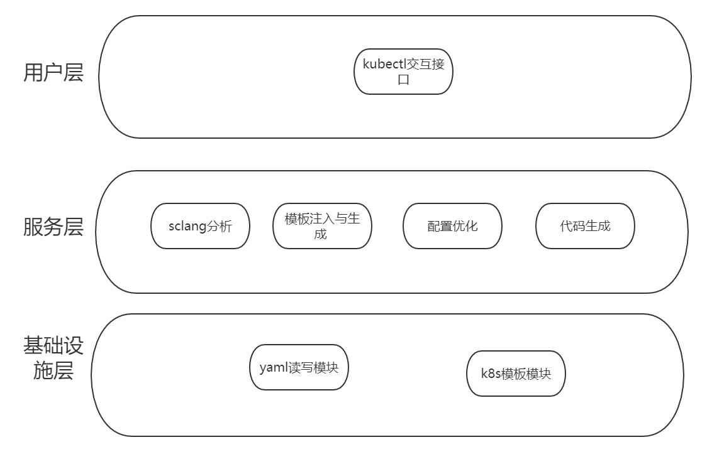
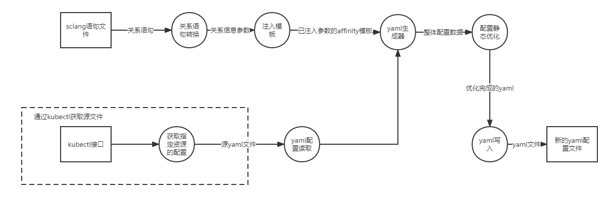
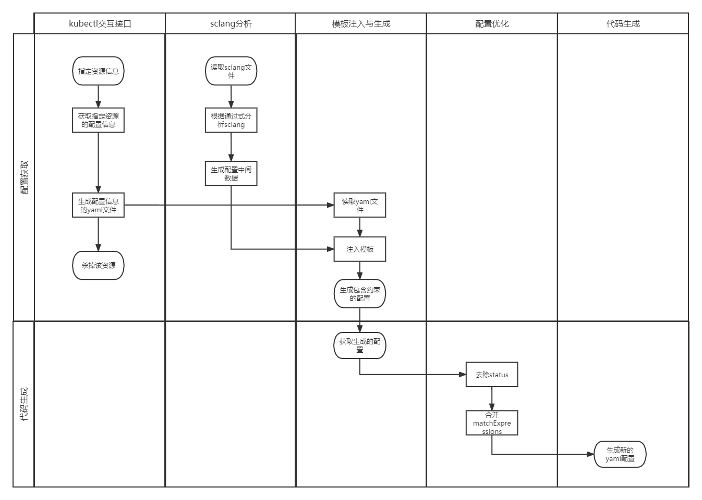

# SchedulerCodeGen文档
## 说明
本文档包含了针对调度器配置的代码生成器的功能、架构以及使用方法介绍。

## 概述
scgen（未取名），是一个针对kubernetes调度器配置文件生成的代码生成器。针对具体的pod，支持读取编写好的结构化的sclang，
向yaml调度配置文件插入调度约束。
该代码生成器主要基于Golang开发，作为kubernetes的插件使用。用户需要根据调度规则编写sclang配置文件，再使用kubectl命令行操作，生成具体的调度文件。

## 程序框架与运行流程

## 软件架构
### 逻辑架构
在逻辑架构视图下，代码生成器从高到低分别分为用户层、服务层与基础设施层。

在**用户层**，用户可感知的代码生成器的入口为kubectl的命令行，由在命令行中输入参数运行。

在**服务模块层**，主要分为sclang分析模块、模板注入与生成模块、配置优化、代码生成共4个模块。
- sclang分析模块主要将用户编写的sclang控制语句，结构化成go语言中的中间数据结构，类似于IR。
- 模板注入与生成模块将sclang转换成的中间数据，注入到kubernetes对象模板中，在这里主要为注入到Pod.PodSpec.Affinity中。
根据条件，分别注入PodAffinity与PodAntiAffinity。
- **配置优化模块**主要将获取到的已经注入模板的数据，进行删除与合并操作，主要有两个部分：
  1. 将pod对象的status字段删除，因为生成器通过kubectl获取Pod的配置，同时会包含运行时状态，需要将运行时状态status删除。
  2. 针对各个字段的或与关系进行合并操作。
     - 多个PodAffinityTerm：与
     - 多个NodeSelectorTerms：或
     - 多个matchExpressions：与
     - matchexpression中同个label下的slice：或
- **代码生成模块**将优化完成的kubenetes资源对象配置生成yaml文件

### 数据流

### 工作流

#### 参考说明

1.  项目库里面会新设立：INFO.md文档，用于记录概念基础和参考文档。
2.  TODO
3.  TODO

#### 使用说明

1.  TODO

#### 参与贡献

1.  TODO

