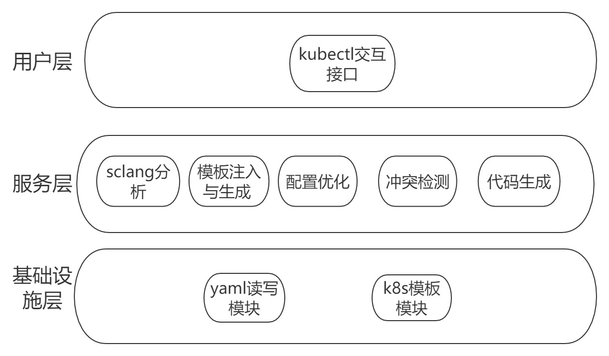
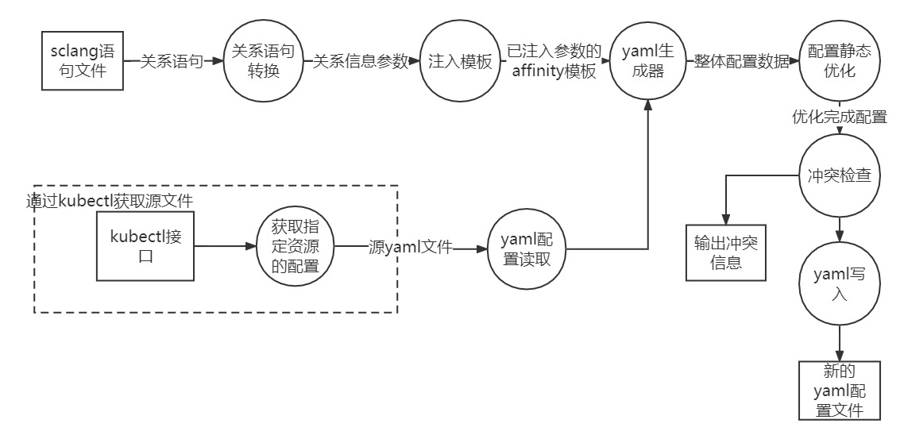
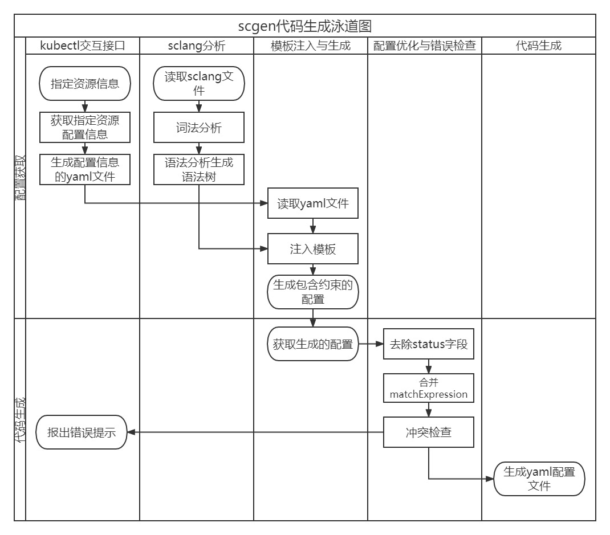

# SchedulerCodeGen文档

## 说明

本文档包含了针对调度器配置的代码生成器的功能、架构以及使用方法介绍。

项目源代码
[System Optimazation Lab, ECNU / SchedulerCodeGen](https://gitee.com/solecnu/scheduler-code-gen)

## 概述

scgen（未取名），是一个针对kubernetes调度器配置文件生成的代码生成器。针对具体的pod，支持读取编写好的结构化的sclang，
向yaml调度配置文件插入调度约束。

该代码生成器基于Golang1.19开发，作为kubernetes的插件使用。
用户需要根据调度规则编写sclang配置文件，再使用kubectl命令行操作，生成具体的调度文件。

## 程序框架与运行流程

## 软件架构

### 逻辑架构

在逻辑架构视图下，代码生成器从高到低分别分为用户层、服务层与基础设施层。

在**用户层**，用户可感知的代码生成器的入口为kubectl的命令行，由在命令行中输入参数运行。

在**服务模块层**，主要分为sclang分析模块、模板注入与生成模块、配置优化、冲突检测、代码生成共5个模块。

- sclang分析模块主要将用户编写的sclang控制语句，结构化成go语言中的中间数据结构，类似于IR。
- 模板注入与生成模块将sclang转换成的中间数据，注入到kubernetes对象模板中，在这里主要为注入到Pod.PodSpec.Affinity中。
  根据条件，分别注入PodAffinity与PodAntiAffinity。
- **配置优化模块**主要将获取到的已经注入模板的数据，进行删除与合并操作，主要有两个部分：
    1. 将pod对象的status字段删除，因为生成器通过kubectl获取Pod的配置，同时会包含运行时状态，需要将运行时状态status删除。
    2. 针对各个字段的或与关系进行合并操作。
        - 多个PodAffinityTerm：与
        - 多个NodeSelectorTerms：或
        - 多个matchExpressions：与
        - matchexpression中同个label下的slice：或
- **冲突检测模块**将静态分析配置有冲突的语句，并报出冲突提示
    1. 配置的逻辑冲突。如在一个文件中 a in b，a notin b同时出现，需要报出错误
- **代码生成模块**将优化完成的kubenetes资源对象配置生成yaml文件

  
  ### 代码生成流程
1. 读取sclang语句文件并转换成语法树SCST
   读取在同目录的sclang文件，通过正则表达式进行语法分析，生成语法树，存储在模板中的数据结构中。
2.  读取源yaml文件，转换成源语法树SST
    通过读取源yaml文件，通过gopkg.in/yaml.v3包，直接将其k8s.io\core\specPod的模板。
3. 将两棵语法树合并
   模板中的语法树数据结构插入到源语法树中
4. 输出合并后的语法树
   将合并后的语法树转换成yaml
#### 数据流




#### 工作流



## sclang语法介绍

配置语言sclang为pod之间的配置关系的简单语言表示，支持命题逻辑关系，覆盖k8s的亲和度关系与阿里的自定义调度规则

该配置语言的语法为：
每一行为一条语句，第一个单词为required或者preferred，表述配置关系是强制的还是只是倾向性；
primaryPod与subPod分别为需要配置亲和度的pod与之有关系的pod；configRelationship表示pod之间的亲和度配置关系，目前支持了依赖与排斥两种关系

- 一条required语句基本结构为：
```
required: primaryPod configRelationship subPod1,subPod2...
```
- 一条preferred语句基本结构为：
```
preferred:weight primaryPod configRelationship subPod1,subPod2...
```
primaryPod与subPod通过label:value来指代唯一的pod

### 字段描述

| 字段 | 描述                                                            | 例子           |
|---|---------------------------------------------------------------|--------------|
| required| 一定要满足的条件约束,为RequiredDuringSchedulingIgnoredDuringExecution    | required     |
|preferred| 倾向于去满足基于权重的约束，PreferredDuringSchedulingIgnoredDuringExecution | preferred：80 |
|weight| 在preferred字段中使用，表示权重，范围为1-100                                 | preferred：80 |
|primaryPod| 需要插入约束的指定pod，使用label:value去指定，格式为`key:value`                  | app:appa     |
|configRelationship| pod之间的关系，为LabelSelectorOperator字段的缩略，in对应&，notin对应^           | A & B        |
|subPod| 为一个列表，用`,`分割，表示需要和primaryPod产生关系的pod组                         | app:appb     |

## 使用说明

下面以部署一个nginx应用为例，介绍配置约束、生成yaml的流程。
### 1. 构建项目

项目基于GO1.19开发，为适配kubectl的插件。建议本地有高于GO1.19版本的Go环境,同时本机需要安装Control Plane Components与kubectl。

#### 1.1获取源码
从sole的repo中获取项目源码  
```
git clone https://gitee.com/solecnu/scheduler-code-gen.git
```
#### 1.2编译项目
进入目录，编译 kubectl-scgen.go  
```
go build kubectl-scgen.go
```
生成可执行文件`kubectl-scgen`
#### 1.3加入PATH
将可执行文件kubectl-scgen放入PATH中。在命令行输入  
```
kubectl scgen -v
``` 
若输出相应的版本信息，贼为构建安装成功。

### 2. 编写SCFile
新建一个文件，将其命名为SCFile(无后缀)，按照sclang的语法编写SCFile

例，选中appa不想和appb放在一起，则写法为
```
required： appa ^ appb
```

### 3. 部署应用
在kubenetes集群中部署nginx，名叫appa，kubernetes集群选用minikube示例。
1. 首先准备一个yaml配置文件：appa.yaml
```yaml
apiVersion: v1
kind: Pod
metadata:
name: appa
labels:
app: appa
spec:
containers:
- name: nginx
  image: nginx:alpine
  ports:
    - containerPort: 80
```
2. 进入appa.yaml所在的目录，执行对应的创建命令
```
kubectl create -f ./appa.yaml
```
3. 检查appa是否配置成功
```shell
kubectl get pod appa
```
输出appa的状态，表示名叫appa的pod正常运行
```shell
PS E:\project\CodeGenerationGo>  kubectl get pod appa 
NAME   READY   STATUS    RESTARTS        AGE
appa   1/1     Running   2 (3h36m ago)   4d23h
```


### 4. 生成
1. 进入SCFile同目录，先检查想要生成配置代码的pod是否存在

2. 再输入scgen命令指定pod名，生成已经插入的配置代码
```shell
kubectl scgen -name=appa
```

可以发现在同目录已经生成了新的配置文件newpod.yaml

## 说明
### kubernetes对象解析

### topologyKey
在Affinity中，

topology的默认配置在
原则上，topologyKey 可以是任何合法的标签键。出于性能和安全原因，topologyKey 有一些限制：

对于 Pod 亲和性而言，在 requiredDuringSchedulingIgnoredDuringExecution 和 preferredDuringSchedulingIgnoredDuringExecution 中，topologyKey 不允许为空。
对于 requiredDuringSchedulingIgnoredDuringExecution 要求的 Pod 反亲和性， 准入控制器 LimitPodHardAntiAffinityTopology 要求 topologyKey 只能是 kubernetes.io/hostname。

## 参考资料
1. [Node affinity and NodeSelector](https://github.com/kubernetes/design-proposals-archive/blob/main/scheduling/nodeaffinity.md)
2. [Inter-pod topological affinity and anti-affinity](https://github.com/kubernetes/design-proposals-archive/blob/main/scheduling/podaffinity.md)

3. [Assigning Pods to Nodes --Kubernetes Documentation](https://kubernetes.io/docs/concepts/scheduling-eviction/assign-pod-node/)


